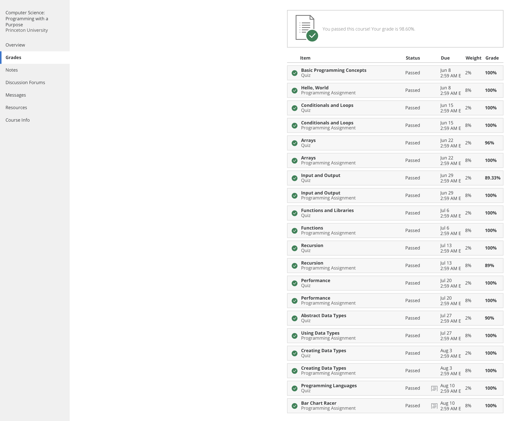

# Princeton-Programming-With-A-Purpose

The repository contains the course work homework and extras from **Coursera** course - [Computer Science: Programming with a Purpose](https://www.coursera.org/learn/cs-programming-java) by Princeton University
In order to execute the programs you would need to setip IDE intellij [mac](https://introcs.cs.princeton.edu/java/mac/) and [windows](https://introcs.cs.princeton.edu/java/windows/).
To compile and run the programs you would use javac-introcs filename.java and java-intocs filename respectively.

